# Mock Execution Demo Flowchart

This flowchart illustrates the flow of the `mock_execution_demo.rs` program from step 0 to step 8, including nested functions, structs, and implementations with one-line descriptions.

```mermaid
flowchart TD
    Start([Start]) --> InitLog["Initialize logging<br/>tracing_subscriber::fmt().init() - Initializes logging system"]

    InitLog --> DBSetup[Database Setup]

    subgraph DBSetup [Step 0: Database Setup]
        direction TB
        DBConnect["Storage::connect(database_url, 5) - Creates PostgreSQL connection pool with max 5 connections"]
        CheckFills["storage.trades().latest_fills(1) - Retrieves the most recent trade fill from database"]
        CheckFills2["storage.trades().latest_fills(1000) - Retrieves up to 1000 latest fills for total count"]
        DBConnect --> CheckFills --> CheckFills2
    end

    DBSetup --> MDSetup[Market Data Setup]

    subgraph MDSetup [Step 1: Setup Market Data Manager + Binance Adapter]
        direction TB
        MDManager["MarketDataManager::new() - Creates a new instance of MarketDataManager for handling market data"]
        Adapter["BinanceSpotAdapter::new() - Creates a new BinanceSpotAdapter for Binance API interaction"]
        MDManager --> Adapter
    end

    MDSetup --> Wire[Wire Adapter]

    subgraph Wire [Step 2: Symbols Wire]
        direction TB
        WireFunc["wire_adapter_to_manager(md_manager, adapter, symbols) - Wires adapter to manager for specified symbols"]
        subgraph WireImpl [wire_adapter_to_manager implementation]
            direction TB
            SnapFn["Creates snapshot_fn closure - Async closure that calls adapter.get_snapshot and maps result"]
            RegSnap["manager.ensure_symbol_with_snapshot_provider(sym, snapshot_fn) - Registers snapshot provider per symbol"]
            WSConnect["adapter.connect_ws(symbols) - Connects websocket and returns unbounded receiver for updates"]
            ForwardTask["tokio::spawn(async move) - Spawns task to forward WS updates to manager via sender"]
            MapUpdate["map_adapter_update_to_message(update) - Maps adapter update to SymbolMessage (Snapshot or Delta)"]
            SendMsg["tx.send(msg) - Sends SymbolMessage to manager's per-symbol channel"]
            SnapFn --> RegSnap --> WSConnect --> ForwardTask --> MapUpdate --> SendMsg
        end
        WireFunc --> WireImpl
    end

    Wire --> Sleep["Sleep 2 seconds<br/>sleep(Duration::from_secs(2)) - Waits for market data streams to initialize"]

    Sleep --> TriView[Create TriView Builder]

    subgraph TriView [Step 3: Create TriView Builder]
        direction TB
        TriBuilder["TriViewBuilder::new(snapshot_getter) - Creates TriViewBuilder with provided snapshot getter"]
        subgraph SnapGetter [snapshot_getter closure]
            direction LR
            GetSnap["adapter_clone.get_snapshot(sym) - Calls adapter's get_snapshot method for symbol"]
            Convert["OrderbookSnapshot::new() - Converts adapter snapshot to canonical OrderbookSnapshot"]
            GetSnap --> Convert
        end
        Subscribe["subscribe_triangle(sym_ab, sym_bc, sym_ac, top_n, interval) - Subscribes to triangle view"]
        subgraph SubscribeImpl [subscribe_triangle implementation]
            direction TB
            SpawnTask["tokio::spawn(async move) - Spawns background task for periodic snapshot fetching"]
            Ticker["tokio::time::interval(interval) - Creates ticker for polling every 100ms"]
            JoinFetch["tokio::join!(fut_a, fut_b, fut_c) - Concurrently fetches snapshots for three symbols"]
            BuildView["build_triview_from_snapshots() - Builds TriView struct from three snapshots"]
            TrySend["tx.try_send(tv) - Attempts to send TriView to bounded channel, drops if full"]
            SpawnTask --> Ticker --> JoinFetch --> BuildView --> TrySend
        end
        TriBuilder --> SnapGetter
        SnapGetter --> Subscribe --> SubscribeImpl
    end

    TriView --> StratConfig[Setup Strategy Config]

    subgraph StratConfig [Step 4: Setup Strategy Config]
        direction TB
        FeeMap["HashMap<String, FeeInfo> - Creates fee map with maker/taker fees per symbol"]
        LotRules["HashMap<String, LotRule> - Creates lot rules with min_size, step_size, min_notional per symbol"]
        Limits["Limits struct - Sets max_notional, min_profit_abs, min_profit_pct, depth_fill_factor"]
        Config["StrategyConfig struct - Combines triangle, base_currency, fee_map, limits, aggression, etc."]
        FeeMap --> LotRules --> Limits --> Config
    end

    StratConfig --> Channels[Create Channels]

    subgraph Channels [Step 5: Create Channels for Communication]
        direction TB
        Unbounded["mpsc::unbounded_channel() - Creates unbounded channels for TriView and execution responses"]
        Bounded["mpsc::channel(128) - Creates bounded channels for trade plans and cancel requests"]
        ForwardSpawn["tokio::spawn(async move) - Spawns tasks to forward between unbounded and bounded channels"]
        Unbounded --> Bounded --> ForwardSpawn
    end

    Channels --> Engine[Create Strategy Engine]

    subgraph Engine [Step 6: Create and Start Strategy Engine]
        direction TB
        NewEngine["StrategyEngine::new(cfg, plan_tx, cancel_tx) - Creates StrategyEngine with config and channels"]
        WithStorage["engine.with_storage(Arc::new(storage)) - Adds Storage instance for trade persistence"]
        Start["engine.start(tri_rx, exec_resp_rx) - Starts detector and monitor loops, returns JoinHandles"]
        subgraph StartImpl [start implementation]
            direction TB
            DetectorTask["tokio::spawn(detector_loop) - Spawns task for opportunity detection"]
            MonitorTask["tokio::spawn(execution_monitor_loop) - Spawns task for execution monitoring"]
            DetectorTask --> MonitorTask
        end
        subgraph DetectorLoop [detector_loop]
            direction TB
            DetectOps["detect_triangular_opportunities(view, fee_map, limits) - Detects opportunities from TriView"]
            PreChecks["pre_trade_checks(op) - Checks concurrency, profit thresholds, exposure"]
            BuildPlan["build_trade_plan(op, cfg) - Builds TradePlan with rounded quantities per LotRule"]
            RegisterInflight["inflight.insert(plan.id, infl_plan) - Registers plan in inflight HashMap"]
            SubmitPlan["exec_tx.send(plan) - Sends TradePlan to execution layer"]
            DetectOps --> PreChecks --> BuildPlan --> RegisterInflight --> SubmitPlan
        end
        subgraph MonitorLoop [execution_monitor_loop]
            direction TB
            HandleReport["handle_exec_report(report) - Updates inflight plan status based on report"]
            ScanTimeouts["scan_timeouts() - Checks for timed-out plans and cancels them"]
            HandleReport --> ScanTimeouts
        end
        NewEngine --> WithStorage --> Start --> StartImpl
        StartImpl --> DetectorLoop
        StartImpl --> MonitorLoop
    end

    Engine --> MockExec[Start Mock Execution]

    subgraph MockExec [Step 7: Start Mock Execution Layer]
        direction TB
        SpawnMock["spawn_mock_execution(plan_rx, exec_resp_tx, cancel_rx) - Spawns mock execution tasks"]
        subgraph MockImpl [spawn_mock_execution implementation]
            direction TB
            CancelTask["tokio::spawn(async move) - Spawns task to listen for cancel requests"]
            PlanTask["tokio::spawn(async move) - Spawns main task to process incoming trade plans"]
            PerPlanWorker["tokio::spawn(async move) - Spawns per-plan worker to simulate leg execution"]
            SimTaker["sleep(20ms); send Filled report - Simulates taker order full fill"]
            SimPassive["sleep(longer); send partial/no fill - Simulates passive order behavior"]
            CancelTask --> PlanTask --> PerPlanWorker --> SimTaker
            PerPlanWorker --> SimPassive
        end
        ForwardSpawns["tokio::spawn() - Spawns tasks to forward messages between bounded and unbounded channels"]
        SpawnMock --> MockImpl --> ForwardSpawns
    end

    MockExec --> Run[Run System]

    subgraph Run [Step 8: Run System and Monitor]
        direction TB
        Select["tokio::select!() - Monitors for Ctrl+C, detector completion, monitor completion, mock exec completion"]
    end

    Run --> End([End])
```

